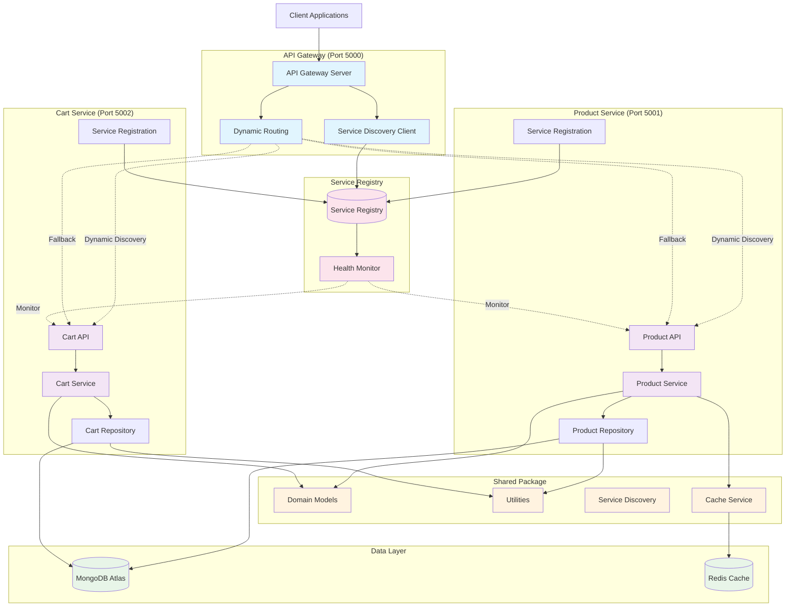
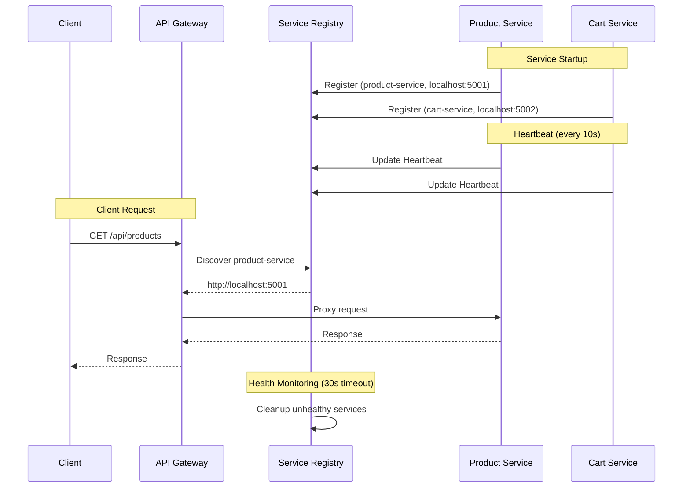
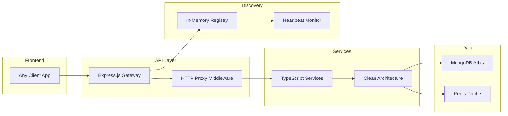

# Zen Grocery API - Microservices Architecture with Service Discovery

## System Architecture Diagram

```mermaid
graph TB
    Client[Client Applications]
    
    subgraph "API Gateway (Port 5000)"
        Gateway[API Gateway Server]
        Discovery[Service Discovery Client]
        Routes[Dynamic Routing]
    end
    
    subgraph "Service Registry"
        Registry[(Service Registry)]
        Health[Health Monitor]
    end
    
    subgraph "Product Service (Port 5001)"
        ProductAPI[Product API]
        ProductService[Product Service]
        ProductRepo[Product Repository]
        ProductReg[Service Registration]
    end
    
    subgraph "Cart Service (Port 5002)"
        CartAPI[Cart API]
        CartService[Cart Service]
        CartRepo[Cart Repository]
        CartReg[Service Registration]
    end
    
    subgraph "Shared Package"
        Models[Domain Models]
        Utils[Utilities]
        ServiceDisco[Service Discovery]
        Cache[Cache Service]
    end
    
    subgraph "Data Layer"
        MongoDB[(MongoDB Atlas)]
        Redis[(Redis Cache)]
    end
    
    %% Client connections
    Client --> Gateway
    
    %% API Gateway connections
    Gateway --> Discovery
    Discovery --> Registry
    Gateway --> Routes
    Routes -.->|Dynamic Discovery| ProductAPI
    Routes -.->|Dynamic Discovery| CartAPI
    Routes -.->|Fallback| ProductAPI
    Routes -.->|Fallback| CartAPI
    
    %% Service Registration
    ProductReg --> Registry
    CartReg --> Registry
    Registry --> Health
    
    %% Service Dependencies
    ProductAPI --> ProductService
    ProductService --> ProductRepo
    CartAPI --> CartService
    CartService --> CartRepo
    
    %% Shared Dependencies
    ProductService --> Models
    ProductService --> Cache
    CartService --> Models
    ProductRepo --> Utils
    CartRepo --> Utils
    
    %% Data connections
    ProductRepo --> MongoDB
    CartRepo --> MongoDB
    Cache --> Redis
    
    %% Health checks
    Health -.->|Monitor| ProductAPI
    Health -.->|Monitor| CartAPI
    
    classDef gateway fill:#e1f5fe
    classDef service fill:#f3e5f5
    classDef data fill:#e8f5e8
    classDef shared fill:#fff3e0
    classDef registry fill:#fce4ec
    
    class Gateway,Discovery,Routes gateway
    class ProductAPI,ProductService,CartAPI,CartService service
    class MongoDB,Redis data
    class Models,Utils,ServiceDisco,Cache shared
    class Registry,Health registry
```

## Service Discovery Flow

```mermaid
sequenceDiagram
    participant C as Client
    participant G as API Gateway
    participant R as Service Registry
    participant P as Product Service
    participant Cart as Cart Service
    
    Note over P,Cart: Service Startup
    P->>R: Register (product-service, localhost:5001)
    Cart->>R: Register (cart-service, localhost:5002)
    
    Note over P,Cart: Heartbeat (every 10s)
    P->>R: Update Heartbeat
    Cart->>R: Update Heartbeat
    
    Note over C,G: Client Request
    C->>G: GET /api/products
    G->>R: Discover product-service
    R-->>G: http://localhost:5001
    G->>P: Proxy request
    P-->>G: Response
    G-->>C: Response
    
    Note over R: Health Monitoring (30s timeout)
    R->>R: Cleanup unhealthy services
```

## Technology Stack

```mermaid
graph LR
    subgraph "Frontend"
        A[Any Client App]
    end
    
    subgraph "API Layer"
        B[Express.js Gateway]
        C[HTTP Proxy Middleware]
    end
    
    subgraph "Services"
        D[TypeScript Services]
        E[Clean Architecture]
    end
    
    subgraph "Discovery"
        F[In-Memory Registry]
        G[Heartbeat Monitor]
    end
    
    subgraph "Data"
        H[MongoDB Atlas]
        I[Redis Cache]
    end
    
    A --> B
    B --> C
    C --> D
    D --> E
    B --> F
    F --> G
    E --> H
    E --> I
```